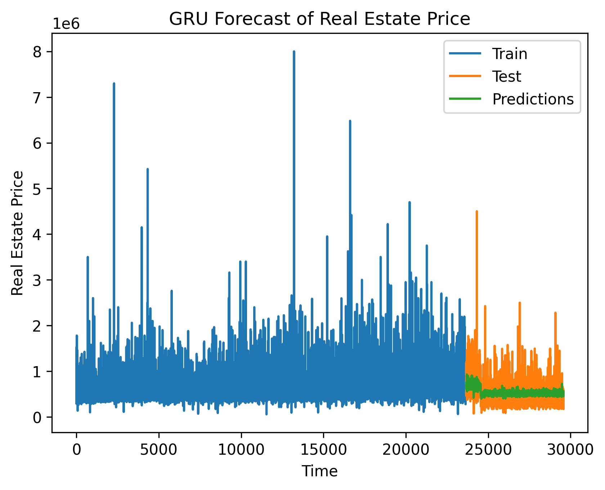

## Folder Structure

```bash
.
├── 01-Ticker
├── 02-Unemployment
├── 03-Revenue  
├── 04-RealEstate 
├── .gitignore
├── .LICENSE
└── README.md
```

## <u> Forecasting Financial and Economic Indicators using Deep Learning </u>

This repository contains Python code for forecasting financial and economic indicators using deep learning techniques. The code is organized into several folders, each focusing on a specific indictor.

## Deep Learning Models

The repository implements various deep learning models commonly used for forecasting tasks. Below are the mathematical representations of these models:

<div align="center">
<h3>Multi-Layer Perceptron (MLP)</h3>
</div>

$$
\mathbf{h} = \sigma\left(\mathbf{W}^{[1]} \mathbf{x} + \mathbf{b}^{[1]}\right)
$$

$$
\mathbf{y} = \mathbf{W}^{[2]} \mathbf{h} + \mathbf{b}^{[2]}
$$

- $\mathbf{x}$: input vector  
- $\mathbf{W}^{[1]}, \mathbf{b}^{[1]}$: weights and bias for the hidden layer  
- $\mathbf{W}^{[2]}, \mathbf{b}^{[2]}$: weights and bias for the output layer  
- $\sigma$: activation function (e.g., ReLU)

<div align="center">
<h3>Recurrent Neural Networks (RNN)</h3>
</div>

```math
\mathbf{h}_t = \phi\left(\mathbf{W}_x \mathbf{x}_t + \mathbf{W}_h \mathbf{h}_{t-1} + \mathbf{b}\right)
```

- $\mathbf{x}_t$: input at time step $t$  
- $\mathbf{h}_t$: hidden state at time $t$  
- $\mathbf{W}_x, \mathbf{W}_h, \mathbf{b}$: weight matrices and bias  
- $\phi$: activation function (e.g., tanh)

<div align="center">
<h3>Long Short-Term Memory (LSTM)</h3>
</div>

```math
\begin{align*}
\mathbf{f}_t &= \sigma(\mathbf{W}_f \mathbf{x}_t + \mathbf{U}_f \mathbf{h}_{t-1} + \mathbf{b}_f) \\
\mathbf{i}_t &= \sigma(\mathbf{W}_i \mathbf{x}_t + \mathbf{U}_i \mathbf{h}_{t-1} + \mathbf{b}_i) \\
\mathbf{o}_t &= \sigma(\mathbf{W}_o \mathbf{x}_t + \mathbf{U}_o \mathbf{h}_{t-1} + \mathbf{b}_o) \\
\tilde{\mathbf{c}}_t &= \tanh(\mathbf{W}_c \mathbf{x}_t + \mathbf{U}_c \mathbf{h}_{t-1} + \mathbf{b}_c) \\
\mathbf{c}_t &= \mathbf{f}_t \odot \mathbf{c}_{t-1} + \mathbf{i}_t \odot \tilde{\mathbf{c}}_t \\
\mathbf{h}_t &= \mathbf{o}_t \odot \tanh(\mathbf{c}_t)
\end{align*}
```

- $\mathbf{x}_t$: input at time $t$  
- $\mathbf{h}_{t-1}$: previous hidden state  
- $\mathbf{c}_{t-1}$: previous cell state  
- $\sigma$: sigmoid activation  
- $\odot$: element-wise multiplication  
- $\tanh$: hyperbolic tangent

<div align="center">
<h3>Gated Recurrent Unit (GRU)</h3>
</div>

```math
\begin{align*}
\mathbf{z}_t &= \sigma(\mathbf{W}_z \mathbf{x}_t + \mathbf{U}_z \mathbf{h}_{t-1} + \mathbf{b}_z) \\
\mathbf{r}_t &= \sigma(\mathbf{W}_r \mathbf{x}_t + \mathbf{U}_r \mathbf{h}_{t-1} + \mathbf{b}_r) \\
\tilde{\mathbf{h}}_t &= \tanh(\mathbf{W}_h \mathbf{x}_t + \mathbf{U}_h (\mathbf{r}_t \odot \mathbf{h}_{t-1}) + \mathbf{b}_h) \\
\mathbf{h}_t &= (1 - \mathbf{z}_t) \odot \mathbf{h}_{t-1} + \mathbf{z}_t \odot \tilde{\mathbf{h}}_t
\end{align*}
```

- $\mathbf{x}_t$: input at time $t$  
- $\mathbf{h}_{t-1}$: previous hidden state  
- $\sigma$: sigmoid activation  
- $\tanh$: hyperbolic tangent

## Financial and Economic Indicators

This repository focuses on forecasting various financial and economic indicators using deep learning models. The indicators include:

### 01 - Ticker (`yfinance`)

- **Type:** Financial Indicator  
- **Description:** Stock price time series obtained via the `yfinance` library. Stock prices reflect investor sentiment, company performance, and macroeconomic conditions.  
- **Utility:** Accurate forecasting enables informed trading strategies, risk management, and portfolio optimization, especially for short- to medium-term investment decisions.

<table>
  <tr>
    <td style="width: 50%;">
      
    </td>
  </tr>
</table>

### 02 - Unemployment (FRED)

- **Type:** Economic Indicator  
- **Description:** The unemployment rate is sourced from the Federal Reserve Economic Data (FRED). It measures the percentage of the labor force that is jobless and actively seeking work.  
- **Utility:** Predicting unemployment is vital for policymakers and economists to anticipate recessions, guide monetary/fiscal policy, and understand consumer spending potential.

<table>
  <tr>
    <td style="width: 50%;">
      
    </td>
  </tr>
</table>

### 03 - Revenue (Walmart)

- **Type:** Financial Indicator  
- **Description:** Walmart's reported revenue over time, typically on a quarterly basis. Revenue data reflects the company's operational performance and consumer demand trends.  
- **Utility:** Forecasting revenue helps stakeholders evaluate business health, anticipate earnings, and make investment or strategic planning decisions.

<!-- <table>
  <tr>
    <td style="width: 50%;">
      
    </td>
  </tr>
</table> -->

### 04 - Real Estate (07-19 New York Real Estate Prices)

- **Type:** Economic Indicator  
- **Description:** Historical prices of real estate in New York from 2007 to 2019. These reflect housing market trends, demand-supply dynamics, and broader economic conditions.  
- **Utility:** Real estate forecasting aids investors, urban planners, and policymakers in anticipating market cycles, adjusting interest rates, and allocating resources for development.

<table>
  <tr>
    <td style="width: 50%;">
      
    </td>
  </tr>
</table>

## References

PyTorch Python API documentation ([Web Link](https://docs.pytorch.org/docs/stable/index.html))

## Usage

Each subdirectory contains its own set of implementations and explanatory notes. To explore the implementations and learn more about each concept, navigate to the respective subdirectory's README.md file.

Feel free to explore, experiment, and contribute to this open source project.
